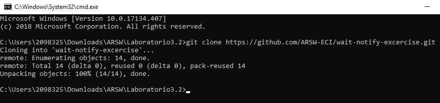

Desarrollo Laboratorio 3.2

    1. Download the project PrimeFinder. this is a program that calculates 
        prime numbers beetween 0 and M (Control.MAXVALUE),concurrently, 
        distributing the searching of them between n (Control.NTHREADS) 
        independent threads.

    2.Modify the application in such way that each t milliseconds of 
        thread execution, all the threads stop and show the number of primes 
        found until that moment. Then, you have to wait until press ENTER 
        in order to resume the threads execution.Use the synchronization 
        mechanisms given by java (wait y notify, notifyAll).

